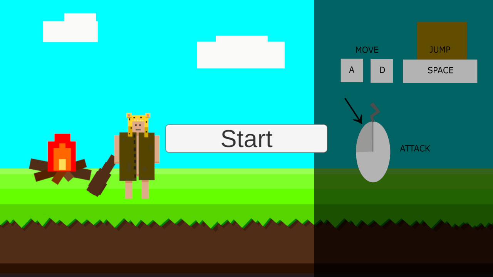
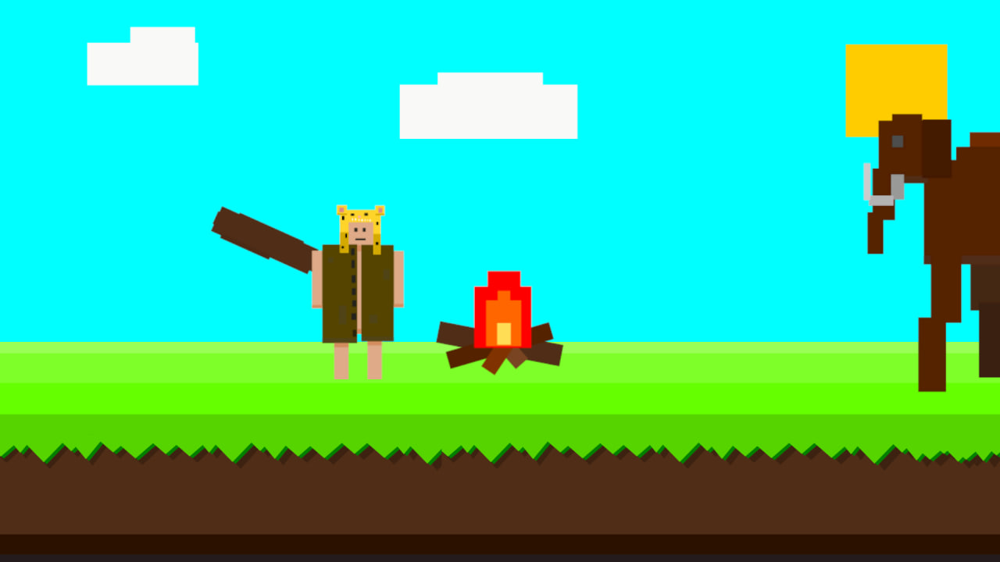
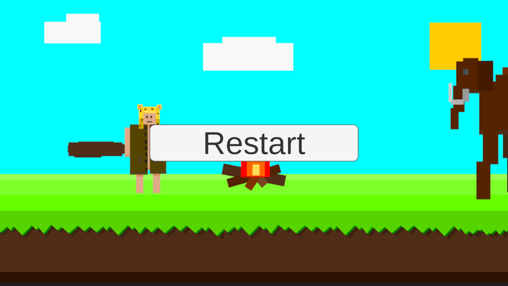
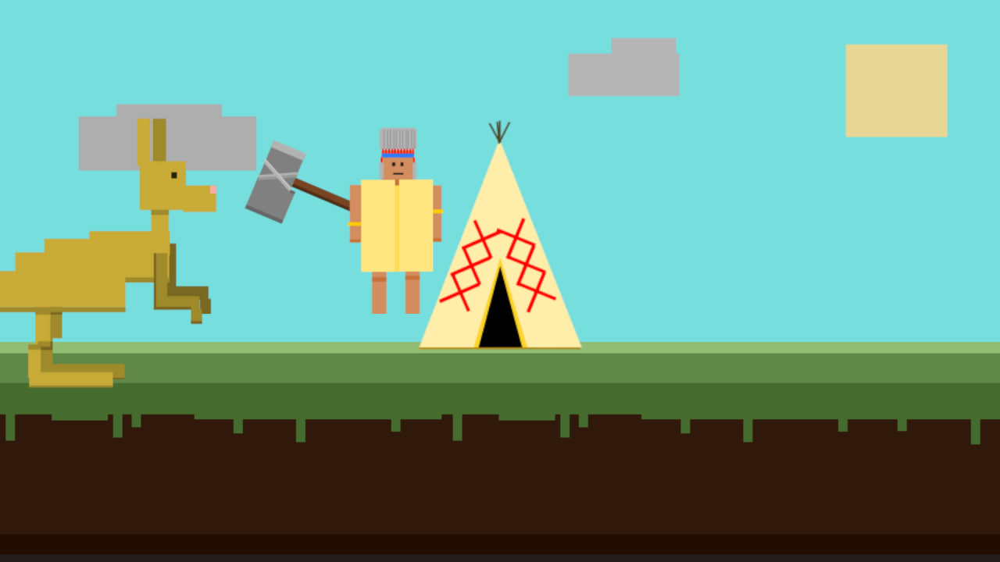
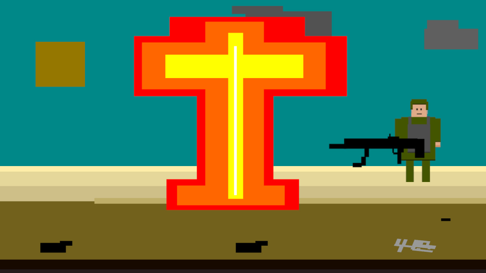

🎮 Evolution (Game Jam Project)

Game Jam: Mini Jam 207: Primal 
Theme: “Primal” 
Duration: 72 hours 
 
🔗 Play the game: [[itch.io link]](https://ostapkotapko.itch.io/evolution)

🎥 Gameplay: 

  
  
  
  
  

🧠 About the Game
Evolution is a 2D action game created for Mini Jam 207 with the theme "Become the villain".
Instead of playing as a hero, you take control of a small but dangerous creature and evolve through combat, becoming stronger with every encounter.

⚔️ Gameplay
Fight enemies and survive
Grow stronger over time
Embrace your role as the villain

🎯 Game Jam Context
This game was developed in a limited time during Mini Jam 207, focusing on creativity, fast iteration, and core gameplay mechanics.

🛠️ Tech
Unity (2D)
C#

🚀 Why this project matters
This project demonstrates:
Ability to develop a complete game under time constraints
Core gameplay programming (movement, combat, interactions)
Understanding of game design based on a given theme
